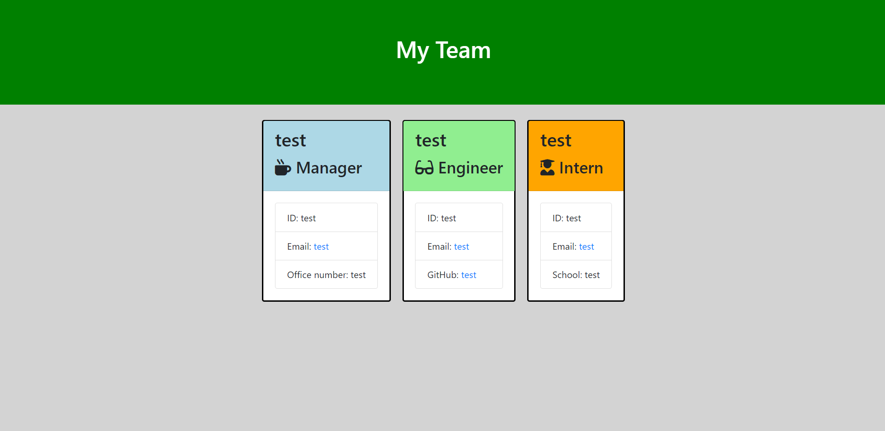

# Team Profile Generator

## Table of Contents

* Description
* Usage
* Screenshot

## Description

This application is a Team Profile generator that can be utilized through node.js.  The user is prompted to select a type of employee to add, then prompted with a series of information input related to the chosen employee type.  Once all the employees are added, selecting "Finish" will create an HTML page with consisting of team profile cards with the input information.

## Usage

Run app.js in Node and the user will be prompted to add an employee type, or select "Finish".  Choosing an employee type will prompt the user to input information about that employee.  After all the inputs, the user will be re-prompted to select another employee type or "Finish".  The user can add as many employee types as needed.  Upon selecting "Finish", an HTML page, "team.html", will be added to an "output" directory.

Employee types in this application: 

* Manager  
* Engineer
* Intern

## Screenshot

